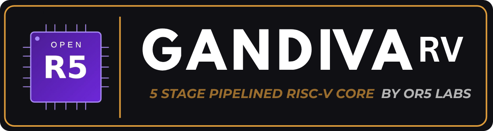

<div align="center">

# Gandiva RISC-V Processor Core



**An Industrial-Grade, Golden-Verified 5-Stage RV32IMACB Processor**


<p align="center">
  
  
  <a href="LICENSE"></a>
  <a href="https://www.linkedin.com/company/open-risc-v/"></a>
  <a href="https://or5.org"></a>
  
</p>
</div>

---
## Overview

**Gandiva** is a high-efficiency, synthesizable 32-bit RISC-V processor core implementing the **RV32IMAC** instruction set architecture alongside the ratified **`B` (bit-manipulation)** extensions and standard **`Zicsr`**. Engineered as an in-order 5-stage pipeline, Gandiva balances high performance with low area, targeting embedded control planes, real-time control, IoT edge devices, and FPGA soft-core deployments.

---

## Key Features

- **5-Stage Pipeline**: Single-issue `IF → ID → EX → MEM → WB` with full operand forwarding.
- **RV32IMACB + Zicsr**: Full support for `I`, `M`, `A`, `C`, `Zicsr`, and ratified bit-manipulation (`Zba`, `Zbb`, `Zbc`, `Zbs`).
- **Dynamic Branch Prediction**: 256-entry gshare predictor, 64-entry BTB, and hardware RAS.
- **Privilege & Security**: M/U modes, User trap delegation (`N`), and 8-region PMP/ePMP (`mseccfg`).
- **Reliability & Misaligned Access**: Optional SECDED ECC register file and hardware unaligned load/store support.
- **Debug & Triggers**: RISC-V Debug 0.13 (JTAG TAP/DM) and `Sdtrig` hardware breakpoints/watchpoints (`mcontrol6`).
- **Interconnect & RTOS**: Native memory bus, drop-in AXI4-Lite master bridge, and turnkey FreeRTOS port.

> For comprehensive microarchitectural descriptions, instruction encodings, CSR listings, and circuit details, please see **[docs.md](docs.md)**.

---

## Microarchitecture

```
             +-------------------------------------------------------------+
             |                 BRANCH PREDICTION UNIT                      |
             |       [ 64-Entry BTB ]  [ 256-Entry gshare ]  [ RAS ]       |
             +------------------------------+------------------------------+
                                            | Next PC / Predict Target
                                            v
     IF STAGE               ID STAGE                EX STAGE             MEM STAGE          WB STAGE
+------------------+   +------------------+   +------------------+   +---------------+   +--------------+
|                  |   |                  |   |   ALU / B-Manip  |   |               |   |              |
| Instruction      |-->| Decode & RVC Exp |-->|   MULDIV Unit    |-->| Data Memory   |-->| Register     |
| Fetch            |   | RegFile Read     |   |   AMO Sequencer  |   | Access & PMP  |   | Writeback    |
|                  |   | SECDED Check     |   |   Branch Resolve |   | Misaligned FSM|   | Commit       |
+------------------+   +------------------+   +------------------+   +---------------+   +--------------+
         ^                                              |                   |                   |
         |                   Pipeline Redirect / Flush  |                   |                   |
         +----------------------------------------------+                   |                   |
         |                                                                  |                   |
         |                                Operand Bypassing & Forwarding   |                   |
         +==================================================================+===================+
```

### Build-Time Configurations

| Feature | Default Configuration | `SECURE` Configuration (`-DSECURE=1`) |
| :--- | :--- | :--- |
| **Privilege Modes** | Machine (`M`) | Machine (`M`) + User (`U`) + User Traps (`N`) |
| **PMP Unit** | None (Flat physical memory) | 8-Region PMP + ePMP (`mseccfg`) |
| **Register File** | Standard 32x32-bit Dual-Read Single-Write | 32x32-bit with SECDED ECC parity |
| **Target Application** | Microcontrollers, high-speed soft cores | Secure enclaves, isolated tasks, safety-critical systems |

---

## Performance & Benchmarks

Gandiva has been evaluated across industry-standard embedded benchmarks in bare-metal execution on physical FPGA silicon.

### CoreMark

| Metric | FPGA (Arty A7 @ 50 MHz) |
| :--- | :--- |
| Iterations | 1,000 |
| Total cycles | 414,937,759 |
| Cycles / iteration | 414,937.8 |
| CoreMark / MHz | **2.41** |

### Dhrystone v2.1

| Metric | FPGA (Arty A7 @ 50 MHz) |
| :--- | :--- |
| Iterations | 2,000,000 |
| Total cycles | 692,352,961 |
| Cycles / iteration | 346.2 |
| Dhrystones / sec / MHz | 2,889 |
| DMIPS / MHz | **1.644** |

### Embench IoT

| Metric | FPGA (Arty A7 @ 50 MHz) |
| :--- | :--- |
| Workloads | 19 |
| Geometric mean cycles | 4,049,170.2 |
| Geomean / MHz | **0.96** |

---

## FPGA Resource Utilization

Synthesis and implementation were performed using **AMD Vivado 2023.2** targeting the **Xilinx Artix-7 100T** FPGA (`xc7a100tcsg324-1`) on the Digilent Arty A7 evaluation board.

### Implementation Metrics (Post-Route)

| Component / Target | Slice LUTs | Logic LUTs | LUTRAM | Registers (FF) | DSP48E1 | Block RAM (RAMB36) | Timing Slack (WNS) |
| :--- | :---: | :---: | :---: | :---: | :---: | :---: | :---: |
| **Gandiva Core (OOC)** | **6,743** (10.6%) | 6,599 | 144 | **2,442** (1.9%) | **12** (5.0%) | 0 (0.0%) | Evaluated @ 50 MHz |
| **Gandiva Reference SoC** | **6,840** (10.8%) | 6,696 | 144 | **2,488** (2.0%) | **12** (5.0%) | **16** (11.8%) | **+5.119 ns** @ 25 MHz |

- **SoC Subsystem Includes**: Gandiva Core, 64 KB dual-port BRAM memory subsystem, Memory-Mapped CLINT Timer, 115200 Baud UART, and GPIO peripheral controllers.
- **Achievable Frequency**: Timing passes comfortably at 25 MHz with `+5.12 ns` positive slack on Artix-7 speed grade -1 (achievable $F_{\text{max}} \gt 30\text{ MHz}$).
- **Target Boards Supported**: Digilent Arty A7-100T (Artix-7) and AMD Xilinx ZCU102 (Zynq UltraScale+).

---

## Repository Structure

```
gandiva/
├── rtl/                        # Core & SoC SystemVerilog source files
│   ├── gandiva_core.sv         # 5-stage pipeline top, forwarding, branch predictor, DM
│   ├── gandiva_soc.sv          # Minimal SoC top (Core, IMEM/DMEM, CLINT, UART)
│   ├── gandiva_axi_lite.sv     # AXI4-Lite Master Bridge
│   ├── gandiva_uart.sv         # 8N1 UART peripheral controller
│   ├── gandiva_trigger.sv      # Sdtrig hardware breakpoint & watchpoint engine
│   ├── gandiva_debug.sv        # RISC-V External Debug Module and DTM
│   └── common/                 # Reusable datapath leaf modules
│       ├── gandiva_pkg.sv      # Architectural package (opcodes, CSRs, types)
│       ├── gandiva_alu.sv      # Arithmetic Logic Unit + 'B' bit-manipulation
│       ├── gandiva_muldiv.sv   # Multi-cycle hardware multiplier and divider
│       ├── gandiva_regfile.sv  # 32-entry dual-read single-write register file
│       ├── gandiva_regfile_ecc.sv # SECDED ECC-protected register file
│       ├── gandiva_csr.sv      # Control & Status Register file
│       ├── gandiva_pmp.sv      # 8-region Physical Memory Protection checker
│       ├── gandiva_rvc.sv      # RVC compressed instruction decompressor
│       ├── gandiva_decode.sv   # Instruction decode unit
│       ├── gandiva_immgen.sv   # Immediate value generator
│       └── gandiva_branch.sv   # Branch condition comparator
├── tb/                         # Testbenches (Smoke, RVFI, Debug, AXI, Triggers, Priv)
├── tools/                      # Golden RV32IM ISA model and lock-step co-simulation
├── sw/                         # Firmware sources, CRT0 startup, and memory generators
├── programs/                   # Python hex generators for directed tests
├── scripts/                    # Utility and profiling scripts (e.g. cycle profiling)
├── sim/                        # Verilator simulation build outputs
├── coremark/                   # EEMBC CoreMark benchmark harness & run scripts
├── dhrystone/                  # Dhrystone 2.1 benchmark harness & run scripts
├── embench/                    # Official Embench IoT benchmark suite harness
├── fpga/                       # FPGA project scripts, XDC constraints, and evaluation reports
│   ├── arty_a7/                # Digilent Arty A7-100T board project
│   ├── zcu102/                 # Xilinx ZCU102 UltraScale+ board project
│   └── eval_results/           # Vivado post-implementation timing & utilization reports
├── rtos/                       # FreeRTOS port, BSP, and automated preemption test
├── docs/                       # Complete documentation site (MkDocs)
├── docs.md                     # Comprehensive Technical Reference Manual
└── build.sh                    # Unified build and test driver
```

---

## Quick Start & Build

### Prerequisites

- **Simulator**: [Verilator](https://www.veripool.org/verilator/) `v5.0+` (recommended) or Icarus Verilog `12+`
- **Host Environment**: Python `3.10+`
- **Toolchain**: RISC-V GCC toolchain (e.g. `riscv-none-elf-gcc` or `riscv64-unknown-elf-gcc` with `rv32imc` multilib support)
- **FPGA Synthesis** *(optional)*: AMD Vivado `2022.1+` and `openFPGALoader`

### 1. Basic Compilation & Smoke Simulation

Clone the repository and run the self-checking smoke test:

```bash
git clone https://github.com/OR5-LABS/gandiva.git
cd gandiva

# Compile RTL with Verilator and execute the self-checking smoke program
./build.sh sim
```

*Expected output:*
```text
[TB] Loading IMEM from: programs/build/smoke.hex
[TB] Reset released
[TB] tohost write: 0x00000001 at cycle 299
[TB] PASS
```

### 2. Lock-Step Golden Co-Simulation

Verify the RTL cycle-by-cycle against the independent Python RV32IM ISA reference model:

```bash
./build.sh cosim
```

*Expected output:*
```text
[cosim] MATCH — 142 retires identical. RTL is ISA-correct.
```

### 3. Verification Suite Commands

The unified driver `./build.sh` provides one-line commands for testing individual subsystems:

```bash
./build.sh rvfi      # Check RISC-V Formal Interface invariants on retirement
./build.sh debug     # Test JTAG Debug Module (halt, resume, GPR/CSR access, stepping)
./build.sh trigger   # Verify Sdtrig hardware breakpoints and watchpoints
./build.sh axi       # Test AXI4-Lite master bridge transactions and SLVERR responses
./build.sh priv      # Run SECURE config tests (M/U/N privilege, PMP isolation, user traps)
./build.sh ecc       # Run SECDED ECC register file single-correct / double-detect tests
./build.sh rtos      # Build and run preemptive FreeRTOS multitasking test
./build.sh clean     # Clean simulation artifacts and build directories
```


---

## Running Benchmarks

### CoreMark

To compile and run CoreMark in Verilator simulation:

```bash
# Run 10 iterations (quick test)
cd coremark && ./run_coremark_10.sh

# Or run the full benchmark (1000 iterations)
./run_coremark.sh
```

To run on physical hardware (Arty A7-100T FPGA):
```bash
./coremark/run_coremark_arty.sh
```

### Dhrystone 2.1

To compile and run the industry-standard 2,000,000-iteration Dhrystone benchmark in simulation:

```bash
cd dhrystone && ./run_dhrystone.sh
```

To synthesize, program, and monitor on the Arty A7-100T board:
```bash
./dhrystone/run_dhrystone_arty_a7.sh
```

### Embench IoT Suite

To run all 19 IoT workloads through the standard Embench test harness in simulation:

```bash
cd embench && ./run_embench.sh
```

---

## FPGA Synthesis & Bring-Up

Gandiva includes turnkey projects for FPGA deployment.

### Building for Digilent Arty A7-100T

With Vivado sourced in your environment:

```bash
cd fpga/arty_a7
vivado -mode batch -source gandiva_arty_a7.tcl
```

This compiles the complete Gandiva SoC with initialized bootloader firmware, integrates the USB-UART interface, and generates the bitstream.

### Programming the Board

Connect the Arty A7 micro-USB cable and flash using `openFPGALoader`:

```bash
openFPGALoader -b arty_a7_100t gandiva_arty_a7.bit
```

Open a terminal at `115200 8N1` (e.g. `/dev/ttyUSB1`) to observe the boot sequence:
```text
========================================
 Gandiva RV32IMACB Processor SoC
 Core: 5-stage in-order @ 25 MHz
========================================
Booting application...
```

---

## Verification & Quality Assurance

Gandiva's verification strategy ensures architectural correctness, interface compliance, and fault tolerance:

1. **Dual-Execution Co-Simulation**: RTL execution trace is piped into `tools/cosim.py`, verifying retirement PC, instruction encoding, register destinations, and written values against `golden_rv32im.py`.
2. **Formal Verification (RVFI)**: Built-in `RISCV_FORMAL` wrapper continuously monitors retirement invariants (monotonicity, zero-register immutability, program counter continuity).
3. **Directed Negative Testing**: Every directed testbench pairs a positive functional test with load-bearing negative assertions (e.g., ensuring illegal PMP access raises an access fault, or verifying disabled timer interrupts stall FreeRTOS preemption).
4. **Constrained-Random Stress Testing**: Automated instruction generator floods the pipeline with random sequences, testing corner-case hazard resolutions, pipeline stalls, and forwardings.

---

## Documentation

Comprehensive architectural specifications, register maps, and peripheral integration guides are available in [`docs/`](docs) and can be viewed as an interactive site:

```bash
pip install -r docs/requirements.txt
mkdocs serve
# Navigate to http://127.0.0.1:8000 in your browser
```

Key documentation resources:
- **[Complete Technical Reference Manual](docs.md)** (exhaustive specification of pipeline, ISA sub-extensions, PMP/ePMP, CSRs, and debug)
- [Pipeline Architecture](docs/architecture.md)
- [Instruction Set & Extensions](docs/isa.md)
- [Branch Prediction Microarchitecture](docs/branch-prediction.md)
- [Privilege, PMP & Security](docs/privilege-and-security.md)
- [Memory Map & CSR Specifications](docs/memory-map.md)
- [Debug Module & Sdtrig Engine](docs/debug.md)
- [Bus & AXI4-Lite Integration](docs/bus-integration.md)

---

## License

Gandiva is licensed under the [MIT License](LICENSE).

